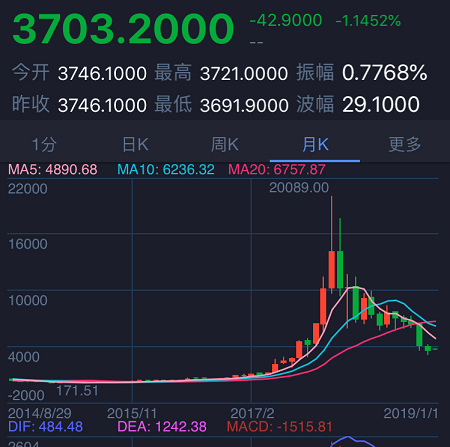
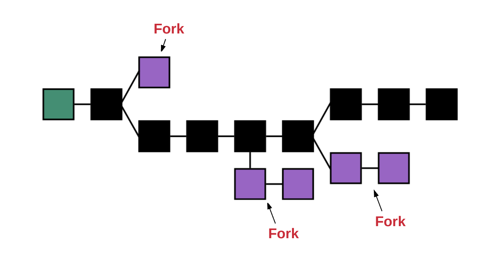
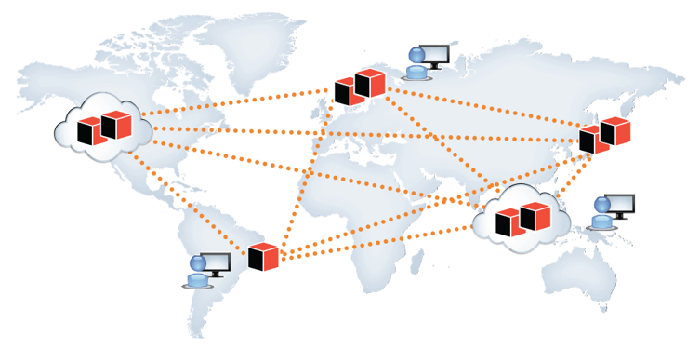
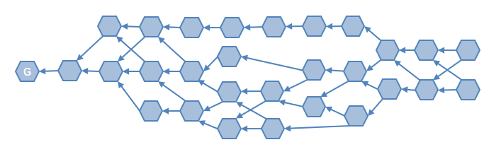

# 区块链介绍

---
## 货币的发展
* 原始的物物交换
  - 效率低，当面交易，极为不便
* 以实物金银为通货
  - 携带方便，不会变质
* 纸币的使用
  - 以国家信用为保证
  - 超发的问题

---
## 货币的发展
* 中心化的数字金融
   - 支付宝，微信钱包，网上银行
   - 可以远程交换
* 去中心化的数字加密货币
   - BTC, ETH, EOS
   - 没有信用背书
   - 超发可控

---
## 比特币

* 2018年最高峰2万美元一个BTC，现在3千多美元一个BTC

---
## 比特币
* 不管你支持它也好，还是反对它也好，巨大的规模已经使你无法忽视它

* 比特币背后的核心技术就是区块链

---

## 区块链的特点

* 匿名公开
* 可以验证
* 无法篡改

---

## 一些基础的密码学知识

 - 哈希
   * SHA256, MAC
   * 哈希碰撞（反向计算，非常难）
 - 非对称加密
   * RSA，椭圆加密
   * 可验签
 - 对称加密

---

## 区块链的组织结构
- 链式结构

---

## 区块链的组织结构
- 分叉

---

## 区块链的网络模型
 - p2p网络模型，无中心

---

## 区块链的核心问题
  - 共识算法(POW, POS, DPOS)
  - 共识算法的本质就是在一群互不信赖的节点中确定出全局的事件顺序，每个节点看到的都相同
  - Pow和挖矿
    * 所有的节点抢占一个发言权，通过计算出一个数值使其和链头的联合hash满足一定的条件
    * 最先挖到矿（获得一把全局锁）的节点有权写入数据，并获得奖励
    * 概率性的确认，最长的链获胜，大量的节点白白浪费了算力
    * 51%攻击，矿场的问题

---

## 区块链技术的发展

* 第一代BTC
* 第二代ETH，提出了智能合约的概念
* 第三代EOS，DAG

---

## 区块链的本质
  - 特殊的分布式数据库
    * 无管理员
    * 无中心
    * 数据可验证
  - 一部完整可信不可修改的**事件历史**
---

## 区块链技术的应用

* 金融
* 博彩
* 溯源
* 可信数据存储
* 政务公开
* 物流
* 电商

---

## 目前主流区块链的不足

- TPS太低
  * 比特币每秒7比交易
  * 以太坊每秒不到20比交易
  * 天猫高峰时的TPS大约在10万
- 能源的浪费
  * 大量矿场，全球电力的0.3%
- 交易成本
  * 手续费偏高

---

## SMART DAG技术

- 有向无环图取代传统的链式结构

---

## SMART DAG技术

- 无需挖矿，采用类似于DPOS的共识技术
- 当前TPS处理能力1万以上（单区块单交易）

---
## 提问与解答

---
## 参考

 - http://www.ruanyifeng.com/blog/2017/12/blockchain-tutorial.html
 - http://bootcamp.arcblock.io/odyssey/abo1-all-in-one.html#cover

